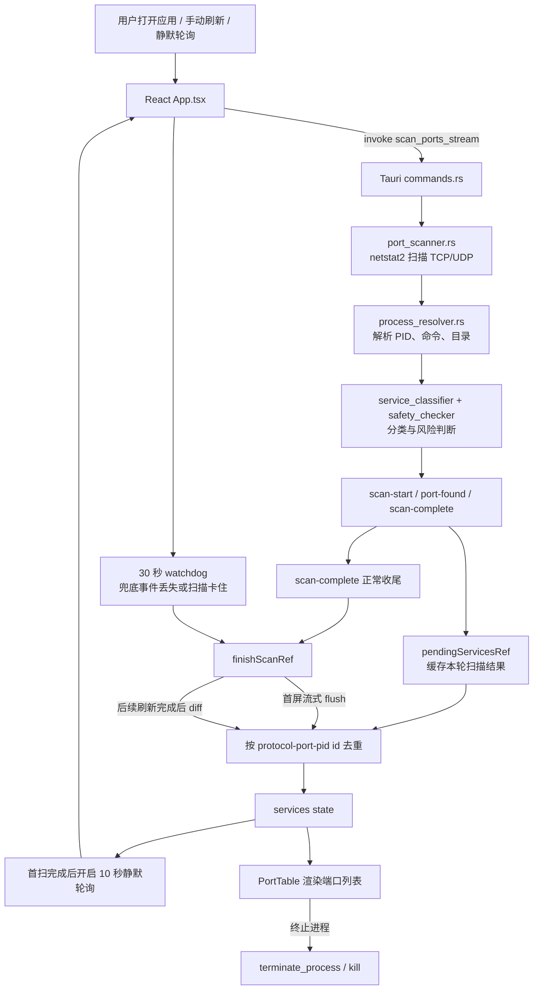

# 🛡️ Port Guardian — 端口守卫

> **[English Version](README_EN.md)** | **中文版**

<div align="center">


**开发端口服务识别与安全清理工具**


[](https://github.com/soBigRice/port-guardian/releases/latest)

</div>

---

## 📖 简介

Port Guardian 是一款基于 [Tauri 2](https://v2.tauri.app/) 构建的 **macOS / Windows 桌面应用**，用于一键扫描、识别和安全清理本地占用 TCP 端口的进程。

在日常开发中，我们经常遇到"端口被占用"的问题——`EADDRINUSE: address already in use :::3000`。传统做法是手动执行 `lsof -i :3000` 找到 PID 再 `kill`，繁琐且容易误杀系统进程。

Port Guardian 将这一切自动化：**扫描 → 识别 → 分类 → 评估风险 → 安全终止**，全程可视化操作，再也不用担心误杀关键服务。

---

## ✨ 核心功能

### 🔍 端口扫描与进程识别
- 自动扫描本机所有 TCP 监听端口
- 解析每个端口对应的进程信息（PID、进程名、用户、命令行、工作目录、可执行文件路径）

### 🌳 进程溯源
- 自动向上遍历父进程链（最多 20 层），追溯进程来源
- 识别启动来源：**Cursor / VSCode / JetBrains / Xcode / iTerm2 / Warp / Terminal / Claude / Docker** 等数十种 IDE、终端和应用

### 🏷️ 智能服务分类
将每个端口服务归类为 **9 大类别**：

| 类别 | 说明 | 示例 |
|------|------|------|
| 🟢 DevService | 开发服务 | Vite, Next.js, Webpack, Angular CLI |
| 🤖 AiDevService | AI 开发服务 | Ollama, Jupyter, TensorBoard |
| 🐳 DockerService | Docker 服务 | Docker Desktop, 容器端口映射 |
| 🗄️ DatabaseService | 数据库服务 | PostgreSQL, MySQL, Redis, MongoDB |
| 🌐 WebServer | Web 服务器 | Nginx, Apache, Caddy |
| ⚙️ SystemService | 系统服务 | AirDrop, mDNSResponder |
| 🏗️ InfraService | 基础设施 | RabbitMQ, Zookeeper |
| 📱 AppService | 应用服务 | ClashX, Surge |
| ❓ Unknown | 未知服务 | — |

### ⚠️ 安全风险评估

| 风险等级 | 颜色 | 含义 | 操作 |
|----------|------|------|------|
| 🟢 Safe | 绿色 | 开发服务，安全可终止 | 直接确认即可终止 |
| 🟡 Caution | 黄色 | 数据库/Docker 等，需谨慎 | 需输入端口号确认 |
| 🔴 Danger | 红色 | 系统关键服务，禁止终止 | 无法执行终止操作 |
| ⚪ Unknown | 灰色 | 无法识别，需自行判断 | 需输入端口号确认 |

### 🎨 UI 特性
- **搜索过滤**：按端口号、进程名、命令、目录、服务名、来源等关键词搜索
- **快速筛选**：一键按风险等级或服务类型筛选
- **详情面板**：点击任一端口条目，右侧展开完整进程信息
- **主题切换**：支持 🌞 亮色 / 🌙 暗色 / 💻 跟随系统 三种主题
- **终止模式**：支持 SIGTERM（优雅终止）和 SIGKILL（强制终止）

---

## 🖼️ 界面预览

> 启动后，Port Guardian 会自动扫描并展示所有监听端口：

```
┌─────────────────────────────────────────────────────────────────┐
│  🛡️ Port Guardian                              [⚙️] [🔄]       │
├─────────────────────────────────────────────────────────────────┤
│  🔍 搜索端口、进程、服务...                                      │
│  [🟢 开发] [🤖 AI] [🗄️ 数据库] [🐳 Docker] [⚙️ 系统]            │
├─────────────────────────────────────────────────────────────────┤
│  端口  │ 服务名称      │ 进程名    │ 来源       │ 风险  │ 操作   │
│  3000  │ Vite          │ node      │ Cursor     │ 🟢   │ [终止] │
│  5432  │ PostgreSQL    │ postgres  │ Terminal   │ 🟡   │ [终止] │
│  8080  │ Next.js       │ node      │ VSCode     │ 🟢   │ [终止] │
│  6379  │ Redis         │ redis-srv │ Docker     │ 🟡   │ [终止] │
│  5000  │ AirDrop       │ launchd   │ System     │ 🔴   │ [禁止] │
├─────────────────────────────────────────────────────────────────┤
│                                              详情面板 →         │
└─────────────────────────────────────────────────────────────────┘
```

---

## 🛠️ 技术架构

```
port-guardian/
├── src/                          # 前端 (React + TypeScript)
│   ├── main.tsx                  # 应用入口
│   ├── App.tsx                   # 主组件（状态管理、过滤、终止逻辑）
│   ├── App.css                   # 全局样式（亮色/暗色主题）
│   ├── types.ts                  # TypeScript 接口定义
│   └── components/
│       ├── PortTable.tsx         # 端口列表表格
│       ├── SearchBar.tsx         # 搜索栏
│       ├── ServiceDetail.tsx     # 服务详情侧边面板
│       ├── ConfirmKillDialog.tsx # 终止确认对话框
│       ├── RiskBadge.tsx         # 风险等级徽章
│       └── Settings.tsx          # 设置对话框（主题切换）
│
└── src-tauri/                    # 后端 (Rust + Tauri 2)
    ├── src/
    │   ├── main.rs               # Rust 入口
    │   ├── lib.rs                # Tauri 应用构建 & 命令注册
    │   ├── commands.rs           # Tauri IPC 命令
    │   ├── port_scanner.rs       # 端口扫描（lsof）
    │   ├── process_resolver.rs   # 进程信息解析（ps + lsof）
    │   ├── process_tree.rs       # 进程树溯源
    │   ├── service_classifier.rs # 服务分类引擎
    │   ├── safety_checker.rs     # 安全等级评估
    │   └── terminator.rs         # 进程终止（SIGTERM/SIGKILL）
    ├── Cargo.toml                # Rust 依赖
    └── tauri.conf.json           # Tauri 配置
```

### 数据流



---

## 🚀 快速开始

### 下载安装

前往 [GitHub Releases](https://github.com/soBigRice/port-guardian/releases/latest) 页面，下载对应平台的最新安装包：

- **macOS**: 下载 `.dmg` 文件（支持 Intel 和 Apple Silicon）
- **Windows**: 下载 `.exe` 安装程序

> 安装后启动应用，后续可在应用设置页点击”检查更新”获取新版本。

#### macOS 首次安装打不开的处理

由于当前安装包还没有做 Apple Developer ID 签名/公证，macOS 首次打开时可能提示“无法打开，因为无法验证开发者”或类似安全提示。可以按下面步骤允许打开：

1. 双击 `.dmg`，将 `Port Guardian.app` 拖到“应用程序”文件夹。
2. 第一次打开如果被系统拦截，先关闭提示窗口。
3. 打开“系统设置”。
4. 进入“隐私与安全性”。
5. 在页面下方“安全性”区域，找到关于 `Port Guardian` 被阻止打开的提示。
6. 点击“仍要打开”或“Open Anyway”。
7. 再次确认打开；如果系统要求，输入本机密码或使用 Touch ID。

Windows 若出现 SmartScreen 提示，可点击“更多信息”，确认来源为本项目 Release 后再选择“仍要运行”。

### 环境要求

- **操作系统**：macOS / Windows
- **Node.js**：≥ 18
- **Rust**：≥ 1.85（支持 edition 2024）
- **macOS 本地构建**：需要 Xcode Command Line Tools

### 安装与运行

```bash
# 1. 克隆仓库
git clone https://github.com/soBigRice/port-guardian.git
cd port-guardian

# 2. 安装前端依赖
npm install

# 3. 启动开发模式
npm run tauri dev
```

### 构建生产版本

```bash
npm run tauri build
```

构建完成后，`.dmg` 安装包位于 `src-tauri/target/release/bundle/dmg/` 目录下。

---

## 📋 可用脚本

| 命令 | 说明 |
|------|------|
| `npm run dev` | 仅启动 Vite 开发服务器（无 Tauri） |
| `npm run build` | TypeScript 编译 + Vite 生产构建 |
| `npm run preview` | 预览生产构建 |
| `npm run tauri dev` | 启动 Tauri 开发模式（前端 + 后端） |
| `npm run tauri build` | 构建生产版本 |

---

## 🔧 配置说明

### Tauri 配置 ([tauri.conf.json](src-tauri/tauri.conf.json))

| 配置项 | 值 | 说明 |
|--------|-----|------|
| 窗口尺寸 | 1100 × 700 | 默认窗口大小 |
| 应用标识 | `com.port-guardian.app` | 应用唯一标识 |
| 开发服务器 | `http://localhost:1420` | Vite 开发服务器地址 |

### Cargo 配置 ([.cargo/config.toml](src-tauri/.cargo/config.toml))

默认使用中国科学技术大学 (USTC) crates.io 镜像源，加速 Rust 依赖下载。

### 开发问题记录（避免重复踩坑）

#### 2026-06-01：更换图标后应用仍显示旧图标

- 问题描述：`icon/icon.png` 已生成到 `src-tauri/icons`，但运行后仍显示旧图标。
- 出现原因：图标资源虽然已生成，但项目未显式声明 `bundle.icon`；同时常规 `tauri build` 在未指定 bundle 时只输出可执行文件，容易误以为 `.app` 图标已更新。
- 影响范围：桌面端图标校验与交付流程（尤其是 macOS `.app`）容易出现“资源已更新但视觉仍旧”的误判。
- 解决方案：在 `src-tauri/tauri.conf.json` 中补充 `bundle.icon`（`32x32`、`128x128`、`128x128@2x`、`icon.icns`、`icon.ico`），并使用 `npm run tauri build -- --bundles app` 生成新的 `.app` 验证图标。
- 后续注意点：每次替换图标后，按“生成图标资源 -> 校验 `bundle.icon` -> 重新打 `app` bundle”流程执行；若系统仍显示旧图标，先关闭旧进程并确认打开的是最新生成的 `.app`。

#### 2026-06-01：图标边缘视觉留白过大

- 问题描述：新图标在系统中显示时，四周暗边留白偏大，主体显得偏小。
- 出现原因：源图包含较宽的外圈深色背景，虽然不是透明空白，但会在缩放到小尺寸后形成“边缘太厚”的视觉效果。
- 影响范围：`32x32` / `64x64` 等小尺寸图标辨识度下降，Dock / Finder / 任务栏观感偏“缩在中间”。
- 解决方案：对源图执行居中方形裁剪（`1146x1146+54+50`），收紧边缘后重新执行 `npm run tauri icon icon/icon.png` 生成全平台图标。
- 后续注意点：图标更新时除了检查尺寸是否正方形，还要检查小尺寸预览的主体占比，必要时先做轻裁剪再生成多尺寸图标。

#### 2026-06-01：裁剪后仍出现黑色直角

- 问题描述：图标已做视觉圆角，但四角仍显示黑色直角底色。
- 出现原因：源 PNG 没有 Alpha 通道，圆角只是颜色过渡效果，非真实透明角。
- 影响范围：深色/浅色桌面背景下都会看到方形外框，影响图标统一性。
- 解决方案：为源图增加真实透明圆角蒙版（`roundrectangle 0,0 1145,1145 180,180`），再重新执行 `npm run tauri icon icon/icon.png` 与 `npm run tauri build -- --bundles app`。
- 后续注意点：每次更换图标后必须检查 `hasAlpha` 和四角像素 alpha 值（应为 0），避免仅视觉圆角导致的黑角回归。

#### 2026-06-01：image2 图标出现棋盘背景与留白过大

- 问题描述：直接使用 image2 生成图标后，外部出现棋盘纹理背景，且主体在画布中占比偏小。
- 出现原因：模型返回了“透明预览样式”的棋盘背景像素（非真实透明），同时默认构图留白较大。
- 影响范围：会导致图标看起来像“没抠干净”，并在小尺寸下辨识度下降。
- 解决方案：先用四角连通域透明化处理去除棋盘背景，再 `trim` 后居中扩展为 `1024x1024`，确保四角 alpha 为 0，再执行 `npm run tauri icon icon/icon.png`。
- 后续注意点：image2 产图接入前必须做两步校验：1) 四角像素是否透明；2) `trim` 后主体占比是否达标（避免过度留白）。

#### 2026-06-01：macOS 系统仍显示旧图标（缓存未刷新）

- 问题描述：应用包内图标资源已更新，但 Finder/Dock 仍显示旧图标。
- 出现原因：macOS 的 `Dock` / `IconServices` / `LaunchServices` 存在缓存，可能继续复用历史图标索引。
- 影响范围：用户侧视觉验证会出现“文件内容已变但系统显示未变”的假象，容易误判修改未生效。
- 解决方案：执行 `touch <App>.app`，清理用户态图标缓存（`com.apple.dock.iconcache`、`com.apple.iconservices.store`），重启 `Finder` / `Dock` / `iconservicesagent`，并对目标 `.app` 执行 `lsregister -f` 重新注册；必要时生成新文件名的 `.app`（如 `Port Guardian Fresh.app`）绕过旧缓存索引。
- 后续注意点：图标改动验收时，优先以“包内 `icon.icns` 校验 + 新文件名 `.app` 启动验证”作为准则，再做系统缓存刷新，避免重复排查图像本身。

#### 2026-06-01：GitHub Actions macOS 发布任务在 Rust 安装阶段失败

- 问题描述：`release (macos-latest, universal-apple-darwin)` 在 `Install Rust stable` 步骤直接失败。
- 出现原因：将 `universal-apple-darwin` 误当作 `rustup target` 安装；该值是 Tauri 构建目标，不是可下载的 `rust-std` 目标。
- 影响范围：macOS 发行包无法构建；Windows 任务可继续运行，导致同一 release 产物不完整。
- 解决方案：工作流中增加 `rust_targets`，macOS 安装 `aarch64-apple-darwin,x86_64-apple-darwin`，Windows 安装 `x86_64-pc-windows-msvc`；`tauri-action` 仍使用 `--target universal-apple-darwin`。
- 后续注意点：CI 中区分“构建目标（Tauri/Cargo args）”与“Rust 标准库目标（rustup targets）”，不要直接复用同一个字段。

#### 2026-06-01：GitHub Actions 构建成功但上传产物失败（No artifacts were found）

- 问题描述：`Build with Tauri` 日志显示 Rust 编译完成，但步骤末尾报错 `No artifacts were found`。
- 出现原因：工作流只传了 `--target`，未显式传 `--bundles`；在当前配置下不会产出可上传的安装包/更新包文件。
- 影响范围：macOS/Windows 发布流程会在上传资源阶段失败，Release 无法附带安装包。
- 解决方案：按平台补充 `bundles` 矩阵字段，macOS 使用 `app,dmg`，Windows 使用 `nsis`，并将 action 参数改为 `--target ... --bundles ...`。
- 后续注意点：看到 “Built application at .../release/<bin>” 不代表已生成发布产物，需确认有 `bundle/*` 目录与安装包文件。

#### 2026-06-01：软件更新检查无效（始终无更新或静默失败）

- 问题描述：应用内点击“检查更新”后无明显结果，更新弹窗不出现。
- 出现原因：多因素叠加：① 发布工作流使用 `releaseDraft: true`，`releases/latest/download/latest.json` 不可用；② 仓库为私有仓库时，客户端匿名请求 GitHub Release 资源会返回 404；③ 界面版本号写死 `0.1.0`，容易误判当前版本状态；④ 更新检查异常被吞掉，UI 无错误态反馈。
- 影响范围：自动更新链路不可用，用户无法通过内置更新拿到新版本。
- 解决方案：工作流改为发布正式 Release（非 Draft），CI 构建时按 tag 同步 `package.json` 与 `tauri.conf.json` 的版本号，前端版本号改为运行时读取，并在更新检查失败时显示错误状态。
- 后续注意点：若继续使用私有仓库发布，需要提供可鉴权更新源；若使用 GitHub `latest.json` 直链，建议使用公开仓库或自建更新分发服务。

#### 2026-06-01：Updater 产物未生成导致更新元数据缺失

- 问题描述：发布流程存在安装包，但更新元数据/签名产物不完整，客户端更新检查不可用。
- 出现原因：`tauri.conf.json` 未显式开启 `bundle.createUpdaterArtifacts`，默认值为 `false`。
- 影响范围：无法稳定产出 `latest.json` 与对应签名链路，Updater 依赖文件缺失。
- 解决方案：在 `bundle` 配置中启用 `"createUpdaterArtifacts": "v1Compatible"`，与当前 `latest.json` 端点格式保持一致。
- 后续注意点：每次调整发布流程后，需验证 Release 中是否包含 `latest.json`、平台安装包和签名文件三类关键产物。

#### 2026-06-02：Windows 发布任务在版本同步步骤失败

- 问题描述：`release (windows-latest, x86_64-pc-windows-msvc)` 在同步版本号时失败，导致 Windows Release 产物无法继续构建。
- 出现原因：GitHub Actions 在 Windows runner 上默认使用 PowerShell 执行 `run` 脚本，但版本同步脚本使用的是 bash 语法。
- 影响范围：只有 Windows 发布任务受影响；macOS 任务不受该脚本 shell 默认值影响。
- 解决方案：在 `Sync app version from tag` 步骤显式设置 `shell: bash`，让所有平台使用一致的脚本解释器。
- 后续注意点：跨平台 workflow 中如果脚本包含 bash 变量展开、here-doc 或 POSIX 条件判断，必须显式声明 `shell: bash`。

#### 2026-06-02：公开仓库后更新仍失败（Release 签名私钥缺失）

- 问题描述：仓库改为公开后，应用内“检查更新”仍失败，`latest.json` 仍然返回 404。
- 出现原因：公开仓库只解决匿名下载权限；实际 Release 工作流仍因缺少 `TAURI_SIGNING_PRIVATE_KEY` 无法完成 updater 签名，所以 GitHub 没有成功发布 `latest.json`。
- 影响范围：macOS/Windows 发布任务都需要该私钥；只要签名失败，自动更新链路就没有可下载的更新元数据。
- 解决方案：重新生成 Tauri updater 签名 key，将公钥写入 `src-tauri/tauri.conf.json`，将私钥写入 GitHub Actions Secret `TAURI_SIGNING_PRIVATE_KEY`，并在 workflow 中增加私钥缺失的前置校验。
- 后续注意点：私钥不能提交到仓库；如果未来已经对外发布过旧公钥版本，替换 updater 公钥会让旧版本无法自动更新到新版本，需保留旧私钥或设计过渡版本。

#### 2026-06-02：GitHub Actions 构建时访问 USTC crates 镜像超时

- 问题描述：macOS 发布任务在 `Build with Tauri` 阶段下载 `tauri-build` 失败，日志显示 `Updating ustc index` 后 curl 超时。
- 出现原因：仓库内 `src-tauri/.cargo/config.toml` 将 crates.io 替换为 USTC 镜像；该配置适合本地国内网络，但 GitHub 海外 runner 访问该镜像不稳定。
- 影响范围：GitHub Actions 上的 Rust 依赖解析可能随机失败，macOS/Windows 都可能受影响；本地构建不一定复现。
- 解决方案：保留仓库中的本地镜像配置，在 Release workflow 中仅对 CI runner 临时改写 Cargo 配置，恢复使用官方 crates.io。
- 后续注意点：网络镜像配置要区分本地开发与 CI 环境；CI 优先使用 runner 所在网络更稳定的源。

#### 2026-06-02：公开 Release 创建后无法继续上传资产

- 问题描述：`tauri-action` 创建 `v0.1.6` Release 后上传 `.dmg` 失败，日志显示 `Cannot upload assets to an immutable release`。
- 出现原因：发布流程直接创建公开 Release，GitHub 将该 Release 标记为 immutable，后续资产上传被拒绝；矩阵任务同时处理同一个 tag 也会放大竞态风险。
- 影响范围：Release 会变成空资产公开版本，`latest.json` 不会生成，应用更新检查继续失败。
- 解决方案：构建任务先上传到 Draft Release，并限制矩阵发布串行；所有平台资产上传完成后，再由独立 `publish-release` job 校验关键资产并公开发布。
- 后续注意点：需要向同一个 Release 追加多平台资产时，优先使用 Draft 聚合产物，最后统一发布；不要先公开再上传。

#### 2026-06-02：Draft Release 无法通过 tag 详情接口查询

- 问题描述：`publish-release` job 在资产已上传到 Draft Release 后仍失败，导致 Release 没有自动公开。
- 出现原因：GitHub 的 `releases/tags/<tag>` 接口不会稳定返回 Draft Release；脚本用该接口查 `v0.1.7` 时拿不到刚创建的 Draft。
- 影响范围：安装包和 `latest.json` 已上传但仍停留在 Draft，客户端匿名更新检查继续 404。
- 解决方案：发布脚本改为调用 `releases?per_page=100` 列表接口，再按 `tag_name` 找到对应 Draft/Release 后校验资产并 PATCH 公开。
- 后续注意点：涉及 Draft Release 的自动化不要依赖 tag 详情接口，优先从 release list 中筛选。

#### 2026-07-01：Updater 签名私钥 secret 格式错误导致 macOS 打包失败

- 问题描述：`release (macos-latest, universal-apple-darwin)` 在生成 updater 产物时失败，日志显示 `failed to decode base64 key: Invalid symbol 32, offset 9`。
- 出现原因：GitHub Actions Secret `TAURI_SIGNING_PRIVATE_KEY` 不是单行 base64 私钥；常见情况是把包含 `untrusted comment:` / `trusted comment:` 的整段 minisign 私钥文件内容粘贴进了 secret，offset 9 对应 `untrusted` 后面的空格。
- 影响范围：macOS/Windows 发布任务都会在 updater 签名阶段失败，Release 无法稳定生成 `latest.json` 和签名更新包。
- 解决方案：在 GitHub 仓库 `Settings -> Secrets and variables -> Actions` 中重新设置 `TAURI_SIGNING_PRIVATE_KEY`，只填写私钥文件里的 base64 私钥行，不要包含注释行、空格、Tab 或换行；workflow 已增加前置格式校验，避免等到打包末尾才失败。
- 后续注意点：不要把公钥或完整私钥文件当作该 secret；如果重新生成 key，需要同步更新 `src-tauri/tauri.conf.json` 中的 `plugins.updater.pubkey`，并注意旧版本自动更新兼容性。

#### 2026-07-01：Updater 公钥使用裸 minisign key 行导致打包失败

- 问题描述：`TAURI_SIGNING_PRIVATE_KEY` 修正后，macOS Release 仍在 updater 产物签名阶段失败，日志显示 `failed to decode pubkey: failed to convert base64 to utf8`。
- 出现原因：Tauri 2.11 期望 `src-tauri/tauri.conf.json` 的 `plugins.updater.pubkey` 是 `.pub` 公钥文件整体内容的 base64 字符串；之前误填了 `.pub` 文件第二行裸 minisign 公钥，base64 解码后是二进制 key bytes，不是 UTF-8 key 文件文本。
- 影响范围：macOS/Windows Release 都会在生成安装包后、上传 Release 资产前失败，导致 `latest.json` 和平台安装包无法发布。
- 解决方案：将 `/Users/superrice/.tauri/port-guardian-key.pub` 整个文件 base64 编码成单行后写入 `plugins.updater.pubkey`，并在 Release workflow 中同时校验私钥 Secret 与配置公钥是否能解码为 UTF-8 key 文件文本。
- 后续注意点：Tauri 2.11 updater key 配置要区分“裸 minisign key 行”和“Tauri CLI 需要的 base64 整文件内容”；私钥 Secret 和配置公钥都不要只复制第二行。

#### 2026-07-01：macOS 打包版启动命令中文路径显示为 M-xx 乱码

- 问题描述：本地开发模式能正常显示中文路径，但线上下载的 macOS 正式版在“启动命令”中把中文目录显示为 `M-hM^P...` 这类转义文本。
- 出现原因：正式版 `.app` 从 Finder / LaunchServices 启动时不一定继承终端的 `LANG` / `LC_ALL`；后端调用 `ps -o args=` 时如果落到 `C` locale，macOS `ps` 会把 UTF-8 中文字节转成 `M-xx` 转义形式。
- 影响范围：影响进程详情、列表搜索和进程链中来自 `ps` 的命令行显示；不影响端口扫描、可执行文件路径读取和终止进程逻辑。
- 解决方案：Unix/macOS 调用 `ps` 的位置显式设置 `LC_ALL=en_US.UTF-8` 和 `LANG=en_US.UTF-8`，确保 `args` 输出按 UTF-8 解码。
- 后续注意点：凡是正式版从系统命令读取包含中文的文本，先确认子进程 locale；不要只从前端字体、CSS 或 React 渲染方向排查乱码。

#### 2026-07-01：更新弹窗只显示版本日期不显示完整 changelog

- 问题描述：应用检测到新版本后，更新内容区域只显示 `## [0.2.7] - 2026-07-01`，没有显示该版本的具体更新条目。
- 出现原因：Release workflow 提取 `CHANGELOG.md` 当前版本段落时使用了 multiline 正则；`$` 在该模式下会匹配行尾，导致正则在版本标题行就提前结束。
- 影响范围：影响 GitHub Release body 和 `latest.json.notes`，进而影响应用内 `updateInfo.body` 渲染；不影响更新包下载、签名校验和安装。
- 解决方案：提取 changelog 时改用不依赖 multiline `$` 的段落正则，匹配到下一个版本标题或文件结尾为止；同时补齐当前 `v0.2.7` Release 和 `latest.json` 的 notes。
- 后续注意点：每次改发版脚本后，除了看 Release 是否成功，还要检查 `latest.json.notes` 是否包含完整版本段落，避免更新弹窗只有标题。

#### 2026-07-02：端口列表偶发同一 PID/端口重复显示

- 问题描述：列表中偶发出现同一个 `端口 + PID + 协议` 的多行重复记录，表现为同一个服务被展示多次。
- 出现原因：前端只在 `port-found` 事件进入 `pendingServicesRef` 时做了单轮去重，但 `flushPendingRef` 写入 `services` 和刷新完成后的 diff 合并没有清理已有重复；在刷新、静默轮询、搜索/筛选切换时机重叠时，半截 pending 结果可能被追加进旧列表，并在下一轮只按 id 集合比较时被误判为“无变化”而保留下来。
- 影响范围：影响端口表格展示、顶部统计数量、批量选择体验；不影响后端真实端口扫描结果和终止进程命令。
- 解决方案：新增统一的 `dedupeServicesById` / `appendUniqueServices` / `mergeScannedServices`，所有写入 `services` 的扫描路径都按 `protocol-port-pid` 生成的 `id` 去重；同时新增 `activeStreamFlushRef` 区分当前扫描是否真的允许流式 flush，避免非流式刷新期间把半截结果插入列表。
- 后续注意点：后续如果新增端口列表写入路径，必须复用统一去重/merge 逻辑；不要只比较 id 集合，还要处理 state 内已有重复 id 的清理。

#### 2026-07-02：扫描完成事件和首屏轮询存在竞态

- 问题描述：首屏扫描偶发不流式展示、结果不完整或扫描状态异常结束。
- 出现原因：`invoke("scan_ports_stream")` 返回后前端立即 fallback 调用 `finishScanRef`，但 Tauri 事件派发可能还没处理完；同时启动自动扫描和可见窗口静默轮询都会立即触发 `refresh`，静默轮询可能先抢到扫描锁。
- 影响范围：影响首屏 loading、扫描进度、端口列表完整性和静默刷新时机；不影响后端扫描出的真实端口数据。
- 解决方案：扫描只由 `scan-complete` 正常收尾，新增 30 秒 watchdog 兜底事件丢失或卡住；新增首扫完成标记，首扫结束后才开启 10 秒静默轮询。
- 后续注意点：扫描链路不要在 `invoke` resolve 后直接结束 UI 状态；如果新增轮询或焦点刷新入口，必须确认不会抢占首屏手动扫描。

#### 2026-07-02：tsx 启动命令里的中文路径显示为百分号编码

- 问题描述：详情面板“启动命令”中出现 `file:///.../%E5%B0%8F...` 这类 URL 百分号编码，进程名也可能显示成 `/Users/superrice` 或 `/Users/.../node` 这类路径片段。
- 出现原因：`tsx` 等 Node 工具会把 `file://` 模块路径编码到命令行；后端直接展示 `ps args` 原文。macOS `ps -o comm=` 对部分进程会返回完整可执行路径或截断后的路径片段，前端又直接把该字段当进程名展示。
- 影响范围：影响列表进程名、详情面板启动命令、进程链展示和搜索体验；不影响终止进程使用的 PID。
- 解决方案：后端解析进程信息时，优先用真实可执行文件路径推导进程名，其次用命令行首个可执行项，最后才使用 `comm` 字段；同时把命令行中的合法 `%HH` 序列按 UTF-8 解码，进程树解析同步复用相同清洗规则。
- 后续注意点：命令行展示问题优先查 `process_resolver.rs` / `process_tree.rs` 的系统输出解析，不要只改前端样式；新增展示字段时要区分真实 PID/路径数据和用户可读展示文本。

---

## 📦 依赖说明

### 前端依赖

| 包名 | 版本 | 说明 |
|------|------|------|
| `react` | ^19.1.0 | UI 框架 |
| `react-dom` | ^19.1.0 | React DOM 渲染 |
| `@tauri-apps/api` | ^2 | Tauri 前端 API |
| `@tauri-apps/plugin-shell` | ^2 | Tauri Shell 插件 |

### 后端依赖

| crate | 版本 | 说明 |
|-------|------|------|
| `tauri` | 2 | Tauri 框架 |
| `tauri-plugin-shell` | 2 | Shell 命令执行插件 |
| `serde` | 1 | 序列化/反序列化 |
| `serde_json` | 1 | JSON 处理 |

---

## ⚡ 工作原理

### 1. 端口扫描
通过 `netstat2` 调用系统原生 API（macOS: libproc, Windows: GetExtendedTcpTable/UdpTable, Linux: /proc/net）扫描 TCP 监听端口和 UDP 绑定端口。

### 2. 进程解析
对每个 PID 执行 `ps -p <PID>` 获取进程详情（父进程 PID、用户、命令行），再通过 `lsof -p <PID>` 获取工作目录和可执行文件路径。

### 3. 进程树溯源
从当前进程向上遍历父进程链（最多 20 层），通过进程名和命令行特征识别启动来源（IDE、终端、浏览器等）。

### 4. 服务分类
根据进程名、命令行参数等特征，将服务归类到 9 大类别。支持识别数十种常见服务，包括但不限于：

- **开发服务**：Vite, Next.js, Webpack, Angular CLI, Nuxt, Remix, SvelteKit, Astro, Gatsby...
- **AI 服务**：Ollama, Jupyter Notebook/Lab, TensorBoard, MLflow, Ray...
- **数据库**：PostgreSQL, MySQL, MongoDB, Redis, Elasticsearch, ClickHouse, MinIO...
- **Web 服务器**：Nginx, Apache, Caddy, Traefik...
- **Docker**：Docker Desktop, 容器端口映射
- **基础设施**：RabbitMQ, Kafka, Zookeeper, Consul, Vault...

### 5. 安全评估
- **SystemService** → 🔴 Danger（不可终止）
- **DatabaseService / DockerService / InfraService / AppService** → 🟡 Caution（需确认）
- **DevService / AiDevService / WebServer** → 🟢 Safe（安全终止）
- **Unknown** → 根据运行用户判断（root 为 Danger，其他为 Unknown）

### 6. 进程终止
- 默认发送 `SIGTERM`（信号 15）优雅终止
- 可选发送 `SIGKILL`（信号 9）强制终止
- 终止后 500ms 检查进程是否已退出

---

## 🤝 贡献

欢迎提交 Issue 和 Pull Request！

1. Fork 本仓库
2. 创建功能分支：`git checkout -b feature/amazing-feature`
3. 提交更改：`git commit -m 'Add amazing feature'`
4. 推送分支：`git push origin feature/amazing-feature`
5. 提交 Pull Request

---

## 📄 许可证

本项目基于 MIT 许可证开源，详见 [LICENSE](LICENSE)。

---

<div align="center">

**用 Port Guardian，让端口管理不再头疼 🛡️**

</div>
